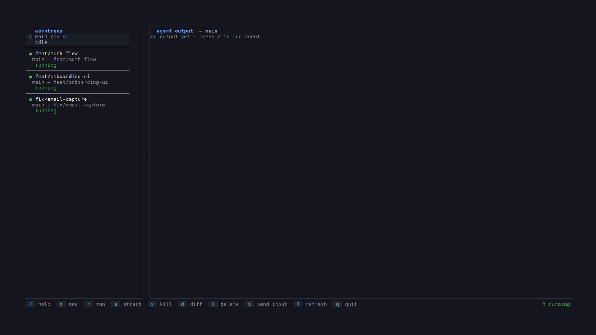

# canopy

**canopy** is a terminal UI for developers running multiple AI coding agents in parallel. One view. All your agents.


[](https://goreportcard.com/report/github.com/isacssw/canopy)
[](LICENSE)


## Table of Contents

- [Why canopy?](#why-canopy)
- [Demo](#demo)
- [Requirements](#requirements)
- [Install](#install)
- [Usage](#usage)
- [Keybinds](#keybinds)
- [How it works](#how-it-works)
- [Config](#config)
- [Contributing](#contributing)
- [Roadmap](#roadmap)
- [License](#license)



Each worktree gets a dedicated **tmux session** so Claude Code runs in a real terminal with full PTY support. Canopy sits above all of them: monitor every agent at a glance and drop in when you need to.

## Why canopy?

Managing 3–5 parallel AI agents across separate terminals is chaotic. You have no overview of what's running, you're constantly switching windows, and there's no signal for when an agent needs your input. Canopy gives you one persistent view: see every agent's state, catch anything waiting for you, and drop in when needed.

## Demo

### Creating a worktree


## Requirements

- [tmux](https://github.com/tmux/tmux) (any modern version)
- [Claude Code](https://claude.ai/code) (`claude` on your PATH)
- A git repository

## Install

**With Go (recommended):**
```bash
go install github.com/isacssw/canopy/cmd/canopy@latest
```

**From source:**
```bash
git clone https://github.com/isacssw/canopy
cd canopy
go build -o canopy ./cmd/canopy
mv canopy ~/.local/bin/   # or any directory on your PATH
```

## Usage

Run from anywhere inside your git repo:

```bash
canopy
```

First run will prompt for your agent command (default: `claude`).

```bash
canopy --help      # show keybinds and usage
canopy --version   # print version
```

Config is saved to `~/.config/canopy/config.json`.

## Keybinds

| Key | Action |
|-----|--------|
| `↑/↓` or `j/k` | Navigate worktrees |
| `n` | Create new worktree (prompts for branch + base) |
| `r` | Run agent in selected worktree |
| `a` | Attach to the live tmux session (full interactive Claude) |
| `x` | Kill running agent |
| `d` | View git diff for selected worktree |
| `D` | Delete worktree (confirm with `y`, then 5-second undo window) |
| `u` / `esc` | Cancel a pending delete during the countdown |
| `i` | Send input to agent when it's waiting |
| `R` | Refresh worktree list |
| `?` | Toggle keybindings help overlay |
| `q` | Quit |

### Mouse support

Click any worktree in the left panel to select it. Use the scroll wheel to scroll the output panel.

### Attaching to an agent

Press `a` to drop into the agent's tmux session and interact with Claude directly. Canopy suspends while you're attached. Press `Ctrl+b d` to detach and return to canopy.

## Agent states

| Icon | State | Meaning |
|------|-------|---------|
| `○` | idle | No agent running |
| `●` | running | Agent active |
| `⚠` | waiting | Agent needs your input, press `i` or `a` |
| `✓` | done | Agent finished cleanly |
| `✗` | error | Agent exited with error |

When an agent transitions to **waiting**, canopy marks it with a yellow `●` badge in the list and emits a terminal bell, so you notice even when working in another window. The badge clears when you navigate to that worktree.

The status bar shows a live summary of agent counts (e.g. `1 running · 2 waiting`) on the right side.

### Idle timeout

With `idle_timeout_secs` set, any agent that has produced no new output for that many seconds is automatically promoted from **running** to **waiting**. This is a useful fallback for agents that don't emit Claude Code's standard input-prompt patterns (e.g. custom wrappers or other AI tools). Set to `0` (the default) to disable.

## How it works

When you press `r`, canopy creates a detached tmux session named `canopy_<repo-hash>_<branch>` and launches your agent command inside it. The output panel shows a live snapshot of the tmux pane, refreshed every 500ms.

Session names include a short hash of the repo root, so branches with the same name across different repos never collide.

Agents keep running after you quit canopy. They're just tmux sessions. You can reattach at any time with `tmux attach -t <session-name>` or by reopening canopy and pressing `a`.

## Config

`~/.config/canopy/config.json`:

```json
{
  "agent_command": "claude",
  "left_panel_width": 38,
  "theme": "github-dark",
  "idle_timeout_secs": 0
}
```

| Field | Default | Description |
|-------|---------|-------------|
| `agent_command` | `"claude"` | Command used to launch the agent. Accepts any executable or wrapper script, e.g. `claude --dangerously-skip-permissions`. |
| `left_panel_width` | `38` | Width of the worktree list panel in columns. Minimum `20`. Omit to use the default. |
| `theme` | `"github-dark"` | UI colour theme. Options: `"github-dark"`, `"nord"`, `"catppuccin"`, `"light"`. Omit or leave empty for the default. |
| `idle_timeout_secs` | `0` | Seconds of no new agent output before status is promoted from **running** to **waiting**. `0` disables the timeout. Useful for non-Claude agents that don't emit standard input-prompt patterns. |

### Themes

| Name | Description |
|------|-------------|
| `github-dark` | Default, GitHub dark palette |
| `nord` | Nord palette, cool blues and greens |
| `catppuccin` | Catppuccin Mocha, pastel dark theme |
| `light` | Light terminal palette |

### Soft delete

Pressing `D` on a worktree asks for confirmation. After pressing `y`, canopy starts a 5-second countdown displayed in the status bar (`Deleting "branch" in 5s…  [u]ndo`). Press `u`, `esc`, or `n` at any point during the countdown to cancel. The delete only executes when the timer reaches zero.

## Contributing

See [CONTRIBUTING.md](CONTRIBUTING.md). Contributions, bug reports, and feature requests are welcome.

## Roadmap

- [ ] Output search / filter
- [ ] Per-agent task label (shown in list)
- [ ] AI summary of last agent run
- [ ] Multi-repo support
- [ ] Export session log

## License

MIT, see [LICENSE](LICENSE)
